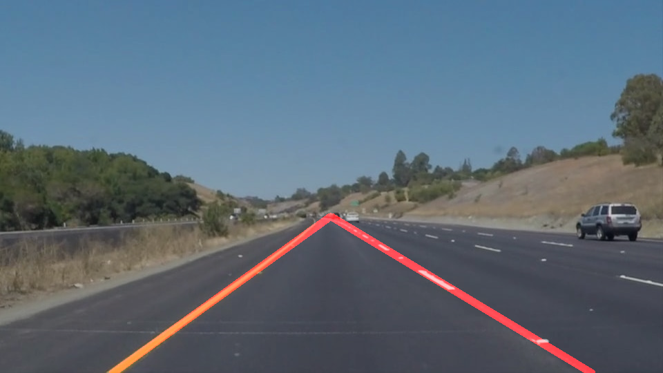

# **Finding Lane Lines on the Road** 

## Writeup Template

### You can use this file as a template for your writeup if you want to submit it as a markdown file. But feel free to use some other method and submit a pdf if you prefer.

---

**Finding Lane Lines on the Road**

The goals / steps of this project are the following:
* Make a pipeline that finds lane lines on the road
* Reflect on your work in a written report

[//]: # (Image References)

[image1]: ./examples/grayscale.jpg "Grayscale"

---

### Reflection

### 1. Describe your pipeline. As part of the description, explain how you modified the draw_lines() function.

My pipeline consisted of 5 steps. First, I converted the images to grayscale, then I applied a gaussian blur to smooth out the image. After it, I applied the canny algohritm obtaining the edges of the images. Then I masked the relevant zone, in this case the camera is located on a fix angle on the top of the vehicle, consequently we can consider a simetric triangle centered in in the midle of the image. The top vertice of the triangle was slected to ignore the sky and horizon line. With experimentation it has decided that the top of the triangle should be ay 58% of the Y axis. Then to obtain the lines the Hough Lines polar algohritm was used. This gave as reasult lines that are expresed by 1 cardinal points (x1,y1) and (x2,y2). To fill the complete line the draw_lines() function interpolated the points in between the 2 caardinal points.

However, in order to draw a single line on the left and right lanes, I change the draw_lines() for draw_lines_average() function to extrapolating the range of ploting using the y axis as reference instead of starting in (x1,y1) and finishing in (x2,y2). I compute the line equation and find the values of xTop and xBottom, using the values yTop = int(yDimention * .58) and yBottom = yDimention. This extends the line from the begining of the masking zone to the end of y axis. Additionally instead of ploting different overlapping lines, I am averaging the lines into one line for the right lane and one for the left lane. This produced a better look which is centered in the road lanes.

If you'd like to include images to show how the pipeline works, here is how to include an image: 

### 2. Identify potential shortcomings with your current pipeline

One potential shortcoming would be what would happen when there is a steep curve. Since I am using a line interpolation for all the range from yDimention * .58 to yDimention. This would create several lines which would cover more of the real dimention of the line.

Another shortcoming could be the sensivility to the floor imperfections. Most of the noise was reduced by the mask since the most noisy zone  was outsite the road. So by removing it with the mask the line detecting ran quite smoothly. However, in the challenge video there was imperfections in the floor and my model could not handle them properly. It interpret them as lines when they were simple floor imperfections.

### 3. Suggest possible improvements to your pipeline

A possible improvement would be to intead of using a simple line, use a series of lines distributed in different segments of the Y axis. This would follow better the curves. Even better the use of splines could provide a smoother solution.

Another potential improvement could be to mask the inside of the road to avoid the noise. But this would need to be test properly since it could possible make the algorithm less acurate when the veihcle is changing lanes. 
